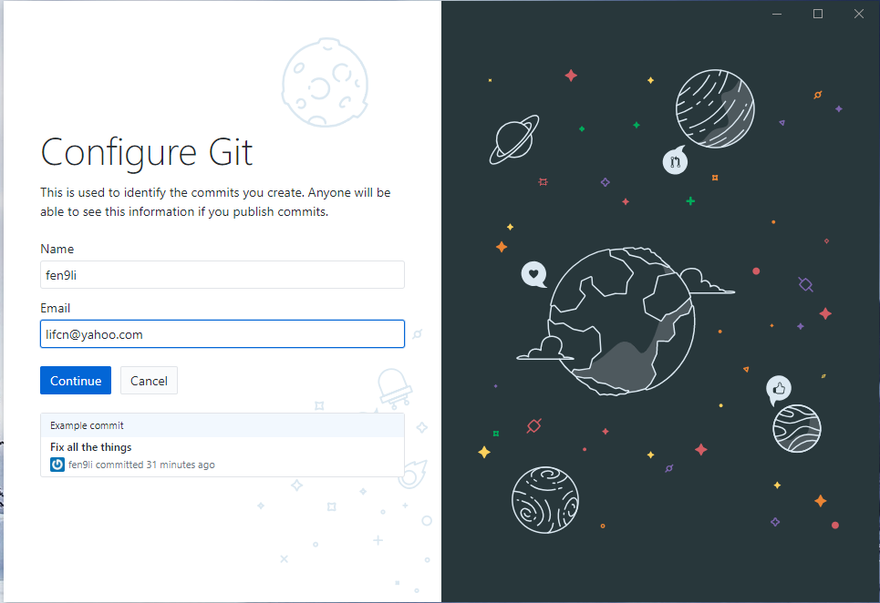

[GitHub Desktop](https://desktop.github.com/)

[Install GitHub Desktop](https://central.github.com/deployments/desktop/desktop/latest/win32).

* Welcome to GitHub Desktop    

* Signin    

* Configure    

* Add existing folder as new repository    

* Create new repository upon existing folder 

